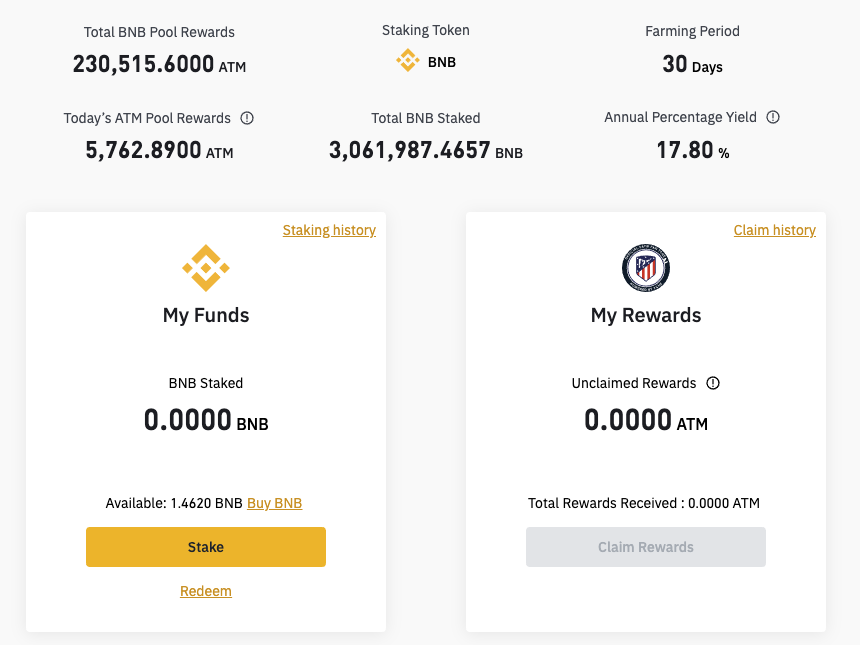
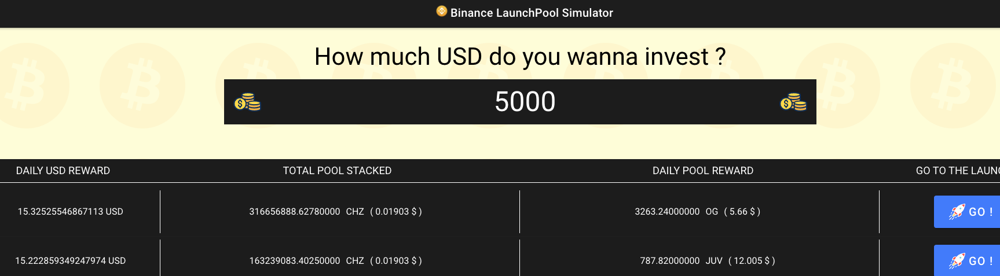

# Binance Launchpool ranking
The aim of this project is to rank all launchpools available on Binance and simulate how much you can earn with an initial investement.

## What is a launchpool
A launchpool is a simple way to invest your crypto to earn crypto. Binance propose you to stack a specific crypto asset to earn another specific crypto asset.

Here is an example of a launchpool on Binance : 


Binance propose here to stake BNB ( Binance token) to earn ATM (Atletico Madrid token).

You can redeem you staking at anytime ans rewards are given each our. A juicy business :star_struck:

## How it work

You can simply test [the online version](https://dev.d35g55g14e3o5a.amplifyapp.com/rank-page).

Enter your investement and the launchpool with the highest return of investment will be on the top of the list :


Data are automatically retreived and update. You do not need to refresh the page to get updated data.

All information are retreive from Binance.

## Technical consideration

Frontend is developped using ionic angular and typescript.

Backend is developped using aws lambda and graphQL.

Hosting is handled using aws amplify.

## Installation

* You first need ionic and amplify CLI.
* This project need an AWS account binded to you amplify CLI.
* Clone the repository :

```
git clone https://github.com/Sam31000/BinanceLaunchPoolRank.git
```

* Install npm dependencies :
```
npm install
```

* Launch the project (before doing that you need to create your backend environement)
```
ionic serve
```


## Author

CHIDIAC Sami

## Licence